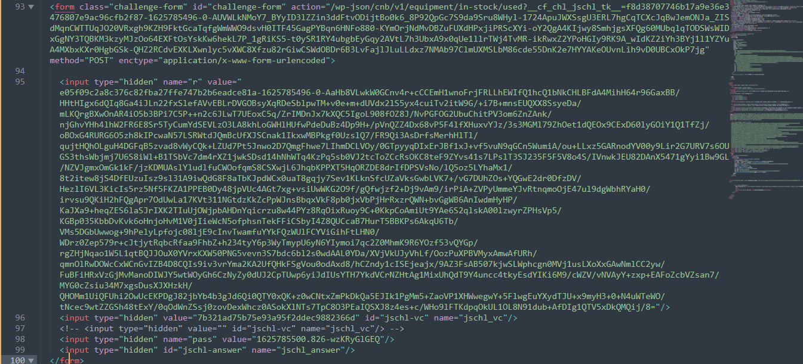

# Cloudflare DDoS Protection Case-Study
Case Study of Cloudflare DDoS Protection

1. Request to 'https://deerequipment.com/wp-json/cnb/v1/equipment/in-stock/used' with respone 503 and index.html
	a._cf_chl_opt
	
	b.Challenge Form
	
